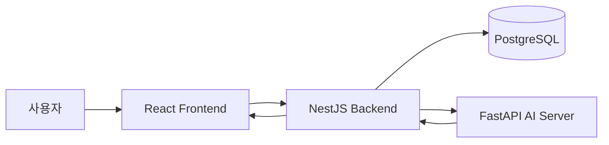
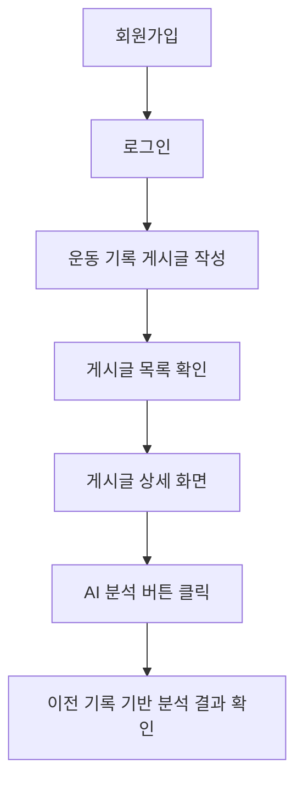
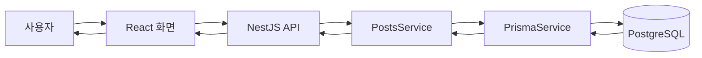
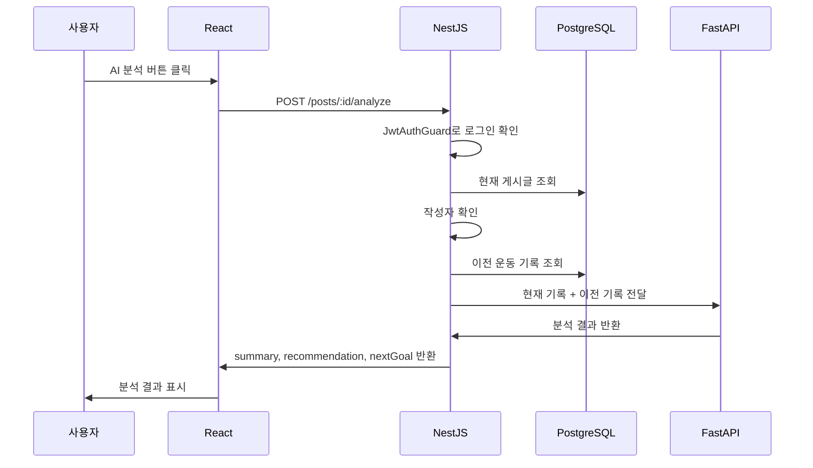
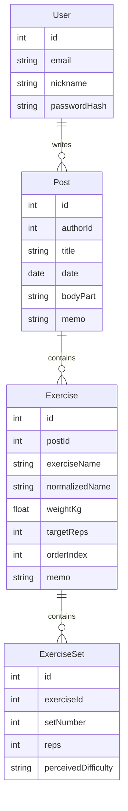
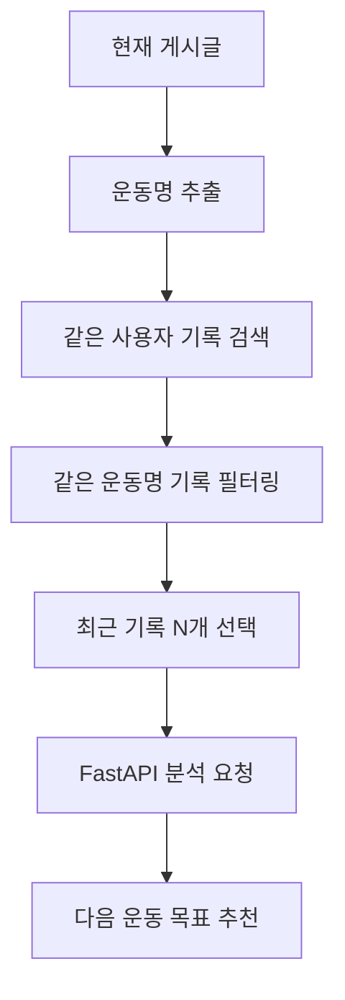
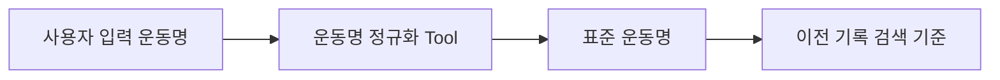
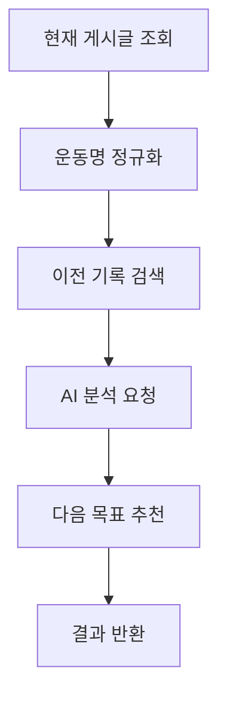

# AI 운동 기록 인증 게시판

> 운동 기록을 게시글처럼 남기고, 사용자의 이전 기록을 기반으로 다음 운동 목표를 추천하는 AI 운동 기록 게시판입니다.  
> React, NestJS, PostgreSQL, FastAPI를 분리해 구성했고, AI 분석은 NestJS가 현재 기록과 이전 기록을 모아 FastAPI에 전달하는 구조로 구현했습니다.

---

## 프로젝트 핵심 요약

| 항목 | 내용 |
|---|---|
| 프로젝트 이름 | AI 운동 기록 인증 게시판 |
| 핵심 주제 | 운동 기록 기반 점진적 과부하 보조 |
| 주요 사용자 | 운동 기록을 남기며 성장감을 확인하고 싶은 운동 초보자 |
| 핵심 기능 | 회원가입, 로그인, 운동 기록 게시글 CRUD, 검색, AI 분석 |
| AI 분석 방식 | 현재 기록 + 이전 기록을 FastAPI로 전달해 분석 결과 반환 |
| RAG 현재 수준 | 같은 사용자 + 같은 운동명 + 과거 날짜 + 최근 3개를 사용하는 구조화 검색 기반 RAG |
| MCP 현재 수준 | 운동명 정규화 tool 후보 설계 |
| Agent 현재 수준 | 정해진 단계를 수행하는 분석 workflow |
| 현재 한계 | pgvector 없는 구조화 검색 기반 RAG, OpenAI 실패 시 rule-based fallback |

---

## 1. 프로젝트 목적

이 프로젝트는 사용자가 운동 기록을 게시글처럼 남기고, AI가 이전 운동 기록을 참고해서 다음 운동 목표를 추천해주는 웹 서비스입니다.

예를 들어 사용자가 벤치프레스 기록을 남기면 다음처럼 비교합니다.

| 구분 | 기록 |
|---|---|
| 이전 기록 | 60kg 8/7/6 |
| 현재 기록 | 60kg 8/8/7 |
| 분석 방향 | 반복 수가 증가했으므로 발전이 있음 |
| 다음 목표 | 같은 무게로 8/8/8 달성 또는 소폭 증량 고려 |

이 프로젝트는 의학 조언이나 부상 진단 서비스가 아닙니다.  
운동 초보자가 꾸준히 기록하고 성장감을 느끼도록 돕는 **학습용 AI 보조 서비스**입니다.

---

## 2. 핵심 기능

| 구분 | 기능 | 상태 |
|---|---|---|
| Auth | 회원가입 | 완료 |
| Auth | 로그인 / JWT | 완료 |
| Auth | 내 정보 조회 | 완료 |
| Posts | 게시글 작성 | 완료 |
| Posts | 게시글 목록 | 완료 |
| Posts | 게시글 상세 | 완료 |
| Posts | 게시글 수정/삭제 | 완료 |
| Search | 제목 / 운동명 검색 | 완료 |
| AI | FastAPI 운동 기록 분석 | 완료 |
| AI | 게시글 상세 화면 AI 분석 버튼 | 완료 |
| AI | OpenAI Responses API 호출 시도 + fallback | 완료 |
| RAG | 같은 사용자/같은 운동명/과거 날짜/최근 3개 검색 | 완료 |
| MCP | 운동명 정규화 tool | 예정 |
| Agent | 분석 workflow 정리 | 예정 |

---

## 3. 기술 스택

| 영역 | 기술 | 역할 |
|---|---|---|
| Frontend | React, Vite, TypeScript, React Router | 화면 구성, API 요청 |
| Backend | NestJS, TypeScript, Prisma | 인증, 게시글 API, DB 조회, AI 서버 호출 |
| Database | PostgreSQL | 사용자/게시글/운동 기록 저장 |
| Auth | JWT, bcrypt | 로그인 인증, 비밀번호 해싱 |
| AI Server | FastAPI, Python, Pydantic BaseModel | AI 분석 처리 |
| Infra | Docker Compose | 로컬 개발 환경 |

---

## 4. 전체 시스템 아키텍처



역할을 나누면 다음과 같습니다.

| 구성 요소 | 담당 역할 |
|---|---|
| React | 사용자가 보는 화면, 버튼 클릭, API 요청 |
| NestJS | 인증, 게시글 CRUD, 권한 검사, DB 조회, FastAPI 호출 |
| PostgreSQL | 사용자, 게시글, 운동 기록 저장 |
| FastAPI | AI 분석 결과 생성 |

중요한 원칙:

```text
React는 FastAPI를 직접 호출하지 않습니다.
AI 분석 요청은 반드시 NestJS를 거칩니다.
```

---

## 5. 사용자 이용 흐름



---

## 6. 일반 게시판 데이터 흐름

게시글 작성/조회는 React, NestJS, PostgreSQL 사이에서 처리됩니다.



예시 흐름:

```text
React 게시글 작성 화면
-> createPost()
-> POST /posts
-> PostsController.create()
-> PostsService.create()
-> PrismaService로 PostgreSQL 저장
-> 저장 결과를 React로 반환
```

---

## 7. AI 분석 요청 흐름

사용자가 게시글 상세 화면에서 AI 분석 버튼을 누르면 다음 순서로 동작합니다.



실제 코드 흐름:

```text
React가 버튼 클릭
-> analyzePost()
-> apiRequest()
-> POST /posts/:id/analyze
-> PostsController.analyze()
-> PostsService.analyze()
-> AiService.analyzePost()
-> FastAPI /analysis/demo
-> React 화면에 결과 표시
```

---

## 8. DB 구조 / ERD

운동 기록은 다음 구조로 저장됩니다.

```text
User
  -> Post[]
      -> Exercise[]
          -> ExerciseSet[]
```



예시:

```text
Post: 6월 13일 가슴 운동
  Exercise: 벤치프레스 60kg
    ExerciseSet: 1세트 8회
    ExerciseSet: 2세트 8회
    ExerciseSet: 3세트 7회
```

---

## 9. 주요 API

### Auth API

| Method | Endpoint | 설명 | 인증 |
|---|---|---|---|
| POST | `/auth/signup` | 회원가입 | 없음 |
| POST | `/auth/login` | 로그인 | 없음 |
| GET | `/auth/me` | 내 정보 조회 | 필요 |

### Posts API

| Method | Endpoint | 설명 | 인증 |
|---|---|---|---|
| POST | `/posts` | 게시글 작성 | 필요 |
| GET | `/posts` | 게시글 목록 | 없음 |
| GET | `/posts?keyword=벤치프레스` | 제목/운동명 검색 | 없음 |
| GET | `/posts/:id` | 게시글 상세 | 없음 |
| PATCH | `/posts/:id` | 게시글 수정 | 필요 |
| DELETE | `/posts/:id` | 게시글 삭제 | 필요 |
| POST | `/posts/:id/analyze` | AI 분석 요청 | 필요 |

보호 API 호출 시 헤더:

```text
Authorization: Bearer accessToken
```

---

## 10. AI 분석 응답 예시

현재 FastAPI는 NestJS가 전달한 현재 기록과 이전 기록을 바탕으로 분석 결과를 반환합니다.
`OPENAI_API_KEY`가 있으면 OpenAI Responses API 호출을 먼저 시도하고, 키가 없거나 호출에 실패하면 rule-based 분석으로 fallback합니다.

```json
{
  "summary": "벤치프레스는 이전 60kg 8/7/6회에서 현재 60kg 8/8/7회로 기록됐습니다.",
  "recommendation": "발전이 있으므로 바로 증량하기보다 현재 무게에서 반복 수를 먼저 채우는 것이 좋습니다.",
  "nextGoal": "다음 운동에서는 벤치프레스를 60kg으로 유지하고 8/8/8에 가까워지는 것을 목표로 해보세요.",
  "referencedPostCount": 1,
  "referencedPosts": [
    {
      "id": 7,
      "title": "이전 가슴 운동",
      "date": "2026-06-01",
      "matchedExercises": ["벤치프레스"]
    }
  ],
  "basis": [
    "같은 사용자 기록만 조회했습니다.",
    "현재 게시글보다 과거 날짜의 기록만 비교했습니다.",
    "같은 운동명 기록을 우선 비교했습니다."
  ],
  "analysisMode": "rule-based"
}
```

---

## 11. RAG 최소 구현 흐름

현재 프로젝트에서 RAG는 완성형 벡터 검색이 아니라, PostgreSQL에 저장된 구조화 데이터를 검색해 AI 분석 재료로 사용하는 흐름입니다.

최소 기준:

```text
로그인한 사용자
+ 같은 운동명
+ 현재 게시글보다 과거 날짜
+ 현재 게시글 제외
+ 최근 3개
-> AI 분석 재료로 사용
```



발표 표현:

```text
현재는 pgvector 없이, 같은 사용자와 같은 운동명의 과거 기록을 최근 3개까지 조회해 AI 분석 재료로 사용하는 구조화 검색 기반 RAG 흐름을 구현했습니다.
```

---

## 12. MCP Tool 후보: 운동명 정규화

운동명은 사용자가 다양하게 입력할 수 있습니다.

```text
bench press
벤치
벤치프레스
Bench Press
```

이 입력들을 같은 운동으로 찾기 위해 운동명 정규화 tool을 설계할 수 있습니다.



예:

```text
bench press
벤치
벤치프레스
-> 벤치프레스
```

현재 발표에서는 완성형 MCP 서버가 아니라, **MCP/tool로 확장 가능한 운동명 정규화 후보**로 설명합니다.

---

## 13. Agent workflow

이 프로젝트의 Agent는 완전 자율 에이전트가 아닙니다.

정해진 단계를 수행하는 분석 workflow입니다.



단계별 담당:

| 단계 | 설명 | 담당 |
|---|---|---|
| 1 | 현재 게시글 조회 | NestJS |
| 2 | 운동명 정규화 | Tool 또는 함수 |
| 3 | 이전 기록 검색 | NestJS + PostgreSQL |
| 4 | AI 분석 요청 | NestJS -> FastAPI |
| 5 | 다음 목표 추천 | FastAPI |
| 6 | 결과 반환 | FastAPI -> NestJS -> React |

발표 표현:

```text
완전 자율 에이전트가 아니라, 운동 기록 분석에 필요한 단계를 순서대로 수행하는 Agent workflow로 설계했습니다.
```

---

## 14. 실행 방법

### 1. PostgreSQL 실행

```bash
docker compose up -d
```

### 2. Backend 실행

```bash
cd backend
npm install
npm run start:dev
```

Backend 기본 주소:

```text
http://localhost:3000
```

### 3. AI Server 실행

```bash
cd ai-server
pip install -r requirements.txt
uvicorn app.main:app --reload --host 0.0.0.0 --port 8000
```

AI Server 기본 주소:

```text
http://localhost:8000
```

### 4. Frontend 실행

```bash
cd frontend
npm install
npm run dev
```

Frontend는 Vite dev server로 실행됩니다.

---

## 15. 빌드 / 검증 방법

### Backend build

```bash
cd backend
npm run build
```

### Frontend build

```bash
cd frontend
npm run build
```

### FastAPI 문법 확인

```bash
cd ai-server
python -m py_compile app/main.py app/routers/analysis.py app/schemas/analysis.py app/services/analysis_service.py
```

### 통합 테스트 흐름

```text
1. AI 서버 health OK
2. 백엔드 health OK
3. 회원가입 OK
4. 로그인 OK
5. 게시글 작성 OK
6. POST /posts/:id/analyze OK
7. AI 분석 결과 응답 OK
```

---

## 16. 데모 시나리오

발표 때 다음 순서로 보여줄 수 있습니다.

```text
1. 회원가입
2. 로그인
3. 운동 기록 게시글 작성
4. 게시글 목록에서 기록 확인
5. 게시글 상세 화면 이동
6. AI 분석 버튼 클릭
7. 이전 기록 기반 분석 결과 확인
8. README의 아키텍처 다이어그램으로 내부 흐름 설명
```

데모용 데이터 예시:

```text
이전 기록: 벤치프레스 60kg 8/7/6
현재 기록: 벤치프레스 60kg 8/8/7
```

---

## 17. 데모 화면

스크린샷은 나중에 아래 경로에 추가합니다.

### 로그인 화면


### 게시글 목록 화면


### 게시글 작성 화면


### 게시글 상세 화면


### AI 분석 결과 화면


---

## 18. 현재 한계

| 한계 | 설명 | 개선 방향 |
|---|---|---|
| AI 분석 품질 한계 | OpenAI 실패 시 rule-based fallback으로 동작 | 프롬프트와 응답 검증 강화 |
| RAG가 구조화 검색 수준 | pgvector 기반 semantic search는 아님 | 나중에 pgvector 확장 |
| 운동명 흔들림 | 벤치/bench press/벤치프레스가 다르게 저장될 수 있음 | 운동명 정규화 tool 추가 |
| Agent는 workflow 수준 | 완전 자율 에이전트는 아님 | 단계별 workflow를 명확히 구현/문서화 |
| 분석 결과 저장 없음 | AI 분석 결과가 DB에 저장되지 않음 | AnalysisResult 모델 추가 가능 |

---

## 19. 향후 개선 방향

우선순위:

```text
1. 운동명 정규화 tool 구현
2. Agent workflow 정리
3. 댓글, 태그, 페이징 보강
4. README와 발표자료 안정화
5. pgvector 기반 유사 기록 검색 확장
6. 운동 성장 그래프 추가
```

---

## 20. 발표용 요약

```text
이 프로젝트는 운동 기록을 게시글처럼 남기고, 이전 기록과 비교해 다음 운동 목표를 추천하는 AI 운동 기록 게시판입니다.

React는 화면을 담당하고, NestJS는 인증과 게시글 API, DB 조회, FastAPI 호출을 담당합니다.
PostgreSQL에는 User, Post, Exercise, ExerciseSet 구조로 운동 기록이 저장됩니다.
AI 분석은 React가 직접 FastAPI를 호출하지 않고, NestJS가 현재 기록과 이전 기록을 모아 FastAPI에 전달하는 구조입니다.

현재 AI 분석은 같은 사용자와 같은 운동명의 과거 기록을 AI 분석 재료로 사용하는 구조화 검색 기반 RAG 흐름을 갖추고 있습니다.
OpenAI API 키가 있으면 OpenAI 분석을 시도하고, 없거나 실패하면 rule-based 분석으로 안전하게 fallback합니다.
MCP는 운동명 정규화 tool 후보로 설계했고, Agent는 현재 게시글 조회, 운동명 정규화, 이전 기록 검색, AI 분석 요청, 다음 목표 추천의 정해진 workflow로 설명합니다.
```
