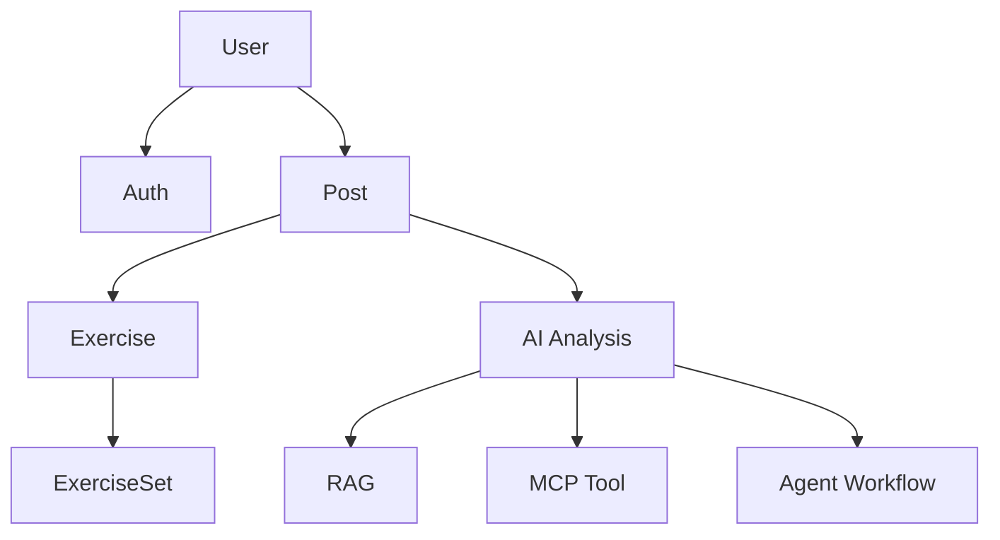

# 03. 도메인 설계 문서

이 문서는 프로젝트의 주요 도메인을 나누고, 각 도메인이 무엇을 책임지는지 정리한다.

도메인은 쉽게 말하면 “프로젝트 안에서 의미 있는 기능 덩어리”다.

이 프로젝트의 핵심 도메인은 다음과 같다.

```text
User
Auth
Post
Exercise
ExerciseSet
AI Analysis
RAG
MCP Tool
Agent Workflow
```

---

## 1. 도메인을 나누는 이유

프로젝트가 작을 때는 모든 코드를 한 곳에 써도 돌아간다.

하지만 기능이 커지면 다음 문제가 생긴다.

- 어디에 어떤 코드를 넣어야 할지 헷갈린다.
- AI 코딩 도구가 관련 없는 파일까지 수정한다.
- 인증, 게시글, AI 분석 코드가 서로 섞인다.
- 나중에 기능을 고칠 때 영향 범위를 알기 어렵다.

그래서 도메인별 책임을 먼저 정해둔다.

---

## 2. 전체 도메인 관계



---

## 3. User 도메인

### 무엇을 책임지는가?

User는 서비스의 사용자를 나타낸다.

저장하는 정보:

```text
id
email
nickname
passwordHash
posts
```

User는 게시글의 작성자다.

### 가지면 안 되는 책임

User가 직접 담당하면 안 되는 것:

- 로그인 로직
- JWT 발급
- 게시글 작성 로직
- AI 분석 로직
- 운동 기록 비교 로직

### 다른 도메인과의 관계

```text
User 1명 -> Post 여러 개 작성 가능
```

Auth는 User를 이용해 로그인과 회원가입을 처리한다.

### 확장 시 주의점

프로필 이미지, 자기소개, 운동 목표 같은 필드를 추가할 수 있다.

하지만 비밀번호 원문을 저장하면 안 된다. 현재처럼 `passwordHash`를 저장해야 한다.

---

## 4. Auth 도메인

### 무엇을 책임지는가?

Auth는 인증을 담당한다.

현재 책임:

- 회원가입
- 로그인
- 비밀번호 해싱
- JWT 발급
- JWT Guard로 보호 API 막기
- `GET /auth/me`로 현재 사용자 확인

### 가지면 안 되는 책임

Auth가 담당하면 안 되는 것:

- 게시글 작성
- 운동 기록 검색
- AI 분석 요청
- FastAPI 호출

### 다른 도메인과의 관계

Auth는 User를 사용한다.

```text
로그인 요청
-> AuthService
-> User 조회
-> 비밀번호 확인
-> JWT 발급
```

Posts API는 Auth의 JWT Guard를 사용해 로그인 여부를 확인한다.

### 확장 시 주의점

Refresh Token, 로그아웃, 소셜 로그인은 나중 확장으로 둔다.

지금은 JWT accessToken 흐름을 안정적으로 유지하는 것이 중요하다.

---

## 5. Post 도메인

### 무엇을 책임지는가?

Post는 운동 기록 게시글의 상위 단위다.

저장하는 정보:

```text
id
authorId
title
date
bodyPart
memo
exercises
```

사용자는 운동한 하루 또는 한 세션을 Post로 기록한다.

### 가지면 안 되는 책임

Post가 직접 담당하면 안 되는 것:

- 비밀번호 확인
- JWT 발급
- FastAPI 내부 분석 로직
- OpenAI API 직접 호출

### 다른 도메인과의 관계

```text
User -> Post[]
Post -> Exercise[]
```

AI Analysis는 Post를 읽어서 현재 기록과 이전 기록을 분석한다.

### 확장 시 주의점

Post에 너무 많은 책임을 넣으면 안 된다.

예를 들어 댓글, 좋아요, 이미지 인증, AI 분석 결과 저장이 추가되면 별도 도메인으로 나누는 것이 좋다.

---

## 6. Exercise 도메인

### 무엇을 책임지는가?

Exercise는 게시글 안에 들어가는 개별 운동이다.

예:

```text
벤치프레스
스쿼트
데드리프트
랫풀다운
```

저장하는 정보:

```text
id
postId
exerciseName
normalizedName
weightKg
targetReps
orderIndex
memo
sets
```

### 가지면 안 되는 책임

Exercise가 담당하면 안 되는 것:

- 사용자 인증
- 게시글 작성자 검사
- AI 응답 문장 생성
- 전체 게시글 API 응답 처리

### 다른 도메인과의 관계

```text
Post -> Exercise[]
Exercise -> ExerciseSet[]
```

RAG 흐름에서는 `normalizedName` 또는 `exerciseName`이 이전 기록 검색 기준이 된다.

### 확장 시 주의점

운동명이 흔들리면 이전 기록 검색이 약해진다.

예:

```text
벤치
벤치프레스
bench press
```

이 세 개를 같은 운동으로 볼 수 있게 하려면 운동명 정규화가 필요하다.

---

## 7. ExerciseSet 도메인

### 무엇을 책임지는가?

ExerciseSet은 운동 하나의 세트 기록이다.

저장하는 정보:

```text
id
exerciseId
setNumber
reps
perceivedDifficulty
```

예:

```text
벤치프레스
1세트 8회
2세트 8회
3세트 7회
```

### 가지면 안 되는 책임

ExerciseSet이 담당하면 안 되는 것:

- 운동명 정규화
- AI 분석 요청
- 사용자 인증
- 게시글 목록 조회

### 다른 도메인과의 관계

```text
Exercise -> ExerciseSet[]
```

AI 분석은 ExerciseSet의 반복 수를 읽어서 현재 기록과 이전 기록을 비교한다.

### 확장 시 주의점

나중에 RPE, 휴식 시간, 실패 여부, 볼륨 계산 등을 추가할 수 있다.

하지만 현재 MVP에서는 reps와 perceivedDifficulty 중심으로 충분하다.

---

## 8. AI Analysis 도메인

### 무엇을 책임지는가?

AI Analysis는 현재 운동 기록과 이전 운동 기록을 바탕으로 분석 결과를 만든다.

현재 반환하는 값:

```text
summary
recommendation
nextGoal
referencedPostCount
```

### 가지면 안 되는 책임

AI Analysis가 담당하면 안 되는 것:

- 회원가입
- 로그인
- 게시글 CRUD
- React 화면 상태 관리
- PostgreSQL 직접 접근

### 다른 도메인과의 관계

```text
Post
-> Exercise
-> ExerciseSet
-> RAG 재료
-> FastAPI 분석
-> React 결과 표시
```

### 확장 시 주의점

현재는 demo analysis다.

OpenAI API 연결은 `ai-server/app/services/analysis_service.py` 중심으로 진행하는 것이 좋다.

---

## 9. RAG 도메인

### 무엇을 책임지는가?

현재 프로젝트에서 RAG는 완성형 벡터 검색이 아니라, 구조화된 운동 기록을 검색해 AI 분석 재료로 사용하는 흐름이다.

최소 기준:

```text
로그인한 사용자
+ 같은 운동명
+ 최근 기록 N개
-> AI 분석 재료로 사용
```

### 가지면 안 되는 책임

RAG가 담당하면 안 되는 것:

- 사용자 로그인 처리
- 게시글 작성 API 전체 처리
- AI 문장 생성 자체
- React 화면 렌더링

### 다른 도메인과의 관계

RAG는 Post, Exercise, ExerciseSet 데이터를 사용한다.

```text
현재 게시글
-> 운동명 추출
-> 같은 사용자 기록 검색
-> 같은 운동명 기록 필터링
-> 최근 기록 N개 선택
-> AI Analysis에 전달
```

### 확장 시 주의점

pgvector는 나중 확장이다.

지금은 구조화 검색 기반 RAG로 발표하는 것이 안전하다.

---

## 10. MCP Tool 도메인

### 무엇을 책임지는가?

MCP Tool 후보는 “운동명 정규화 tool”이다.

예:

```text
bench press
벤치
벤치프레스
-> 벤치프레스
```

이 tool은 서로 다른 표현을 표준 운동명으로 바꿔준다.

### 가지면 안 되는 책임

운동명 정규화 tool이 담당하면 안 되는 것:

- 이전 기록 검색 전체
- AI 분석 문장 생성
- 사용자 인증
- 게시글 저장

### 다른 도메인과의 관계

```text
Exercise.exerciseName
-> 운동명 정규화 tool
-> Exercise.normalizedName
-> RAG 검색 기준
```

### 확장 시 주의점

처음부터 완전한 MCP 서버를 만들 필요는 없다.

먼저 함수 또는 서비스로 구현하고, 발표에서는 “MCP/tool로 확장 가능한 후보”라고 설명해도 된다.

---

## 11. Agent Workflow 도메인

### 무엇을 책임지는가?

Agent Workflow는 AI 분석 요청이 여러 단계를 거쳐 처리되는 흐름을 정리한다.

현재 목표 흐름:

```text
1. 현재 게시글 조회
2. 운동명 정규화
3. 이전 기록 검색
4. AI 분석 요청
5. 다음 운동 목표 추천
6. 결과 반환
```

### 가지면 안 되는 책임

Agent Workflow를 완전 자율 에이전트처럼 과장하면 안 된다.

현재는 정해진 순서대로 수행하는 workflow다.

### 다른 도메인과의 관계

```text
Post
-> MCP Tool
-> RAG
-> AI Analysis
-> React
```

### 확장 시 주의점

발표에서는 다음처럼 말하는 것이 안전하다.

```text
완전 자율 에이전트가 아니라, 운동 기록 분석에 필요한 단계를 순서대로 수행하는 Agent workflow로 설계했다.
```

---

## 12. 도메인 추가 전 체크리스트

새 도메인을 만들기 전에 다음 질문을 확인한다.

```text
이 기능은 기존 도메인 안에 넣어도 되는가?
새 도메인으로 분리할 만큼 독립적인 책임이 있는가?
DB 모델이 필요한가?
API가 필요한가?
React 화면이 필요한가?
AI 서버와 관련이 있는가?
발표에서 설명할 가치가 있는가?
```

초보자에게 중요한 기준은 다음이다.

```text
한 파일이나 한 도메인이 너무 많은 일을 하기 시작하면 분리를 고민한다.
```
