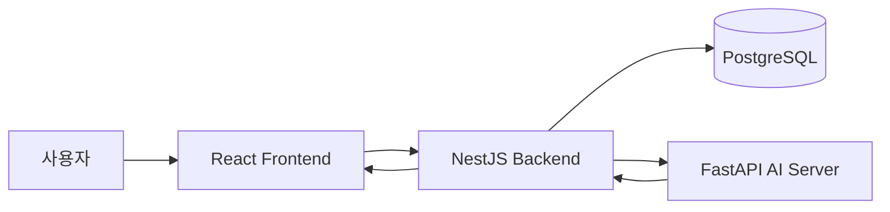
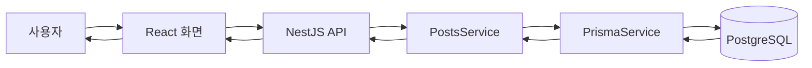
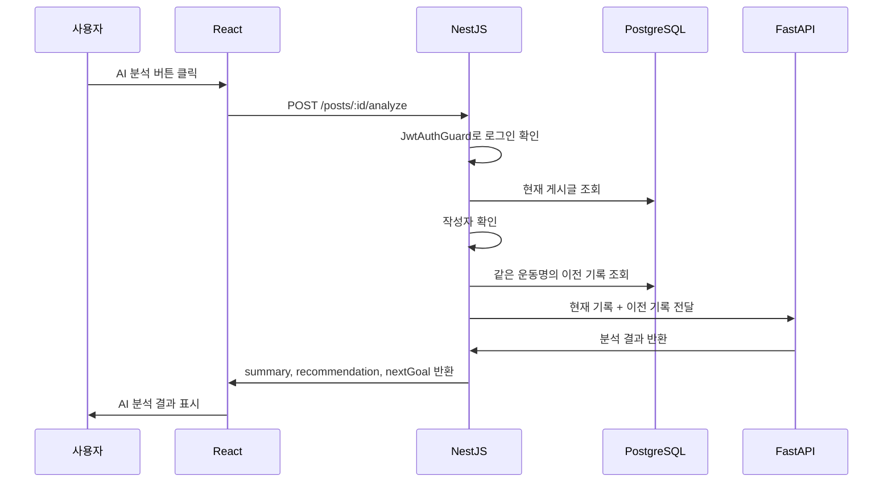

# 04. 아키텍처 문서

이 문서는 프로젝트가 어떤 구조로 동작하는지 설명한다.

초보자에게 아키텍처는 어렵게 느껴질 수 있지만, 이 프로젝트에서는 다음 질문에 답하면 된다.

```text
사용자가 버튼을 누르면 어떤 서버로 가는가?
그 서버는 어떤 파일에서 처리하는가?
DB는 누가 접근하는가?
AI 서버는 누가 호출하는가?
응답은 어떤 경로로 돌아오는가?
```

---

## 1. 전체 시스템 구조



역할은 다음과 같다.

| 구성 요소 | 역할 |
|---|---|
| React | 사용자가 보는 화면, 버튼 클릭, API 요청 |
| NestJS | 인증, 게시글 API, DB 조회, FastAPI 호출 |
| PostgreSQL | 사용자/게시글/운동 기록 저장 |
| FastAPI | AI 분석 응답 생성 |

---

## 2. React의 역할

React는 화면을 담당한다.

현재 React가 담당하는 것:

- 회원가입 화면
- 로그인 화면
- 게시글 목록 화면
- 게시글 작성 화면
- 게시글 상세 화면
- AI 분석 버튼
- AI 분석 결과 표시
- accessToken localStorage 저장
- NestJS API 호출

React가 하지 않는 것:

- DB 직접 접근
- FastAPI 직접 호출
- JWT 검증
- 이전 운동 기록 검색
- AI 분석 로직 수행

---

## 3. NestJS Backend의 역할

NestJS는 이 프로젝트의 중심 서버다.

현재 NestJS가 담당하는 것:

- 회원가입
- 로그인
- JWT 발급
- JWT Guard
- 게시글 CRUD
- 작성자 검사
- 제목/운동명 검색
- 현재 게시글 조회
- 이전 운동 기록 조회
- FastAPI 호출
- React에 최종 응답 반환

NestJS는 React와 FastAPI 사이의 중간 관리자 역할을 한다.

---

## 4. PostgreSQL의 역할

PostgreSQL은 데이터를 저장한다.

저장하는 데이터:

- User
- Post
- Exercise
- ExerciseSet

PostgreSQL은 판단하지 않는다.

예를 들어 “다음 운동 목표가 무엇인가?”는 DB가 판단하지 않는다. DB는 기록을 저장하고, NestJS가 조회하고, FastAPI가 분석한다.

---

## 5. FastAPI AI Server의 역할

FastAPI는 AI 분석을 담당한다.

현재 담당하는 것:

- `/health`
- `/analysis/demo`
- demo 분석 결과 반환

앞으로 담당할 것:

- OpenAI API 호출
- 프롬프트 구성
- 현재 기록과 이전 기록 비교
- summary, recommendation, nextGoal 생성

FastAPI가 하지 않는 것:

- React와 직접 통신
- JWT 인증
- PostgreSQL 직접 조회
- 게시글 CRUD

---

## 6. 일반 게시판 데이터 흐름

게시글 작성/조회 흐름은 다음과 같다.



예시: 게시글 작성

```text
React 게시글 작성 버튼 클릭
-> createPost()
-> apiRequest()
-> POST /posts
-> PostsController.create()
-> PostsService.create()
-> PrismaService로 DB 저장
-> 저장된 게시글 응답
-> React 화면 업데이트
```

---

## 7. AI 분석 요청 흐름

AI 분석 요청은 다음 흐름이다.



실제 코드 흐름으로 보면 다음과 같다.

```text
React가 버튼 클릭
-> analyzePost()
-> apiRequest()
-> POST /posts/:id/analyze
-> PostsController.analyze()
-> PostsService.analyze()
-> AiService.analyzePost()
-> FastAPI /analysis/demo
-> React 화면에 결과 표시
```

---

## 8. 왜 React가 FastAPI를 직접 호출하지 않는가?

React가 FastAPI를 직접 호출하면 구조가 단순해 보일 수 있다.

하지만 이 프로젝트에서는 그렇게 하지 않는다.

이유는 다음과 같다.

### 1. 인증은 NestJS가 담당한다

AI 분석은 로그인한 사용자만 요청할 수 있어야 한다.

또한 작성자 본인의 게시글만 분석해야 한다.

이 검사는 NestJS의 JwtAuthGuard와 PostsService에서 처리한다.

### 2. 이전 기록 조회는 NestJS가 담당한다

FastAPI는 DB를 직접 모른다.

현재 게시글과 이전 기록은 NestJS가 PostgreSQL에서 조회해 FastAPI로 보내준다.

### 3. FastAPI는 AI 분석만 담당해야 한다

FastAPI가 인증, DB 조회, 게시글 권한 검사까지 맡으면 책임이 너무 커진다.

따라서 FastAPI는 다음만 담당한다.

```text
NestJS가 보내준 데이터
-> 분석
-> 결과 반환
```

---

## 9. Layered Architecture

Layered Architecture는 역할별로 코드를 나누는 방식이다.

현재 프로젝트의 백엔드 흐름은 다음과 같다.

```text
Controller -> Service -> PrismaService -> PostgreSQL
```

향후 Repository를 도입하면 다음처럼 바뀔 수 있다.

```text
Controller -> Service -> Repository -> PrismaService -> PostgreSQL
```

중요한 점은 지금 당장 Repository를 억지로 도입하는 것이 아니다.

현재 구조가 동작하고 있으므로, Repository 분리는 별도 작업으로만 진행한다.

---

## 10. Controller 책임

Controller는 HTTP 요청을 받는 입구다.

예:

```text
POST /posts/:id/analyze
-> PostsController.analyze()
```

Controller가 해야 하는 일:

- URL과 메서드 정의
- Guard 적용
- DTO 받기
- Service 호출

Controller가 하면 안 되는 일:

- Prisma 직접 호출
- FastAPI 직접 호출
- 복잡한 분석 흐름 작성

---

## 11. Service 책임

Service는 실제 기능 흐름을 조립한다.

예:

```text
PostsService.analyze()
```

Service가 해야 하는 일:

- 현재 게시글 조회
- 작성자 검사
- 운동명 추출
- 이전 기록 조회
- AiService 호출
- 결과 반환

Service가 조심해야 하는 일:

- 모든 코드를 한 함수에 길게 몰아넣기
- 프론트 화면 전용 로직을 너무 많이 넣기
- AI 프롬프트 로직까지 과하게 담당하기

---

## 12. Repository 책임

Repository는 DB 접근만 담당하는 계층이다.

현재 프로젝트에는 명확한 Repository 파일이 없다.

따라서 현재는 다음 원칙을 따른다.

```text
기존 Service + PrismaService 구조를 유지한다.
Repository 도입은 별도 리팩토링 작업으로만 한다.
```

도입한다면 좋은 후보는 다음이다.

```text
backend/src/posts/posts.repository.ts
```

이 파일은 다음을 담당할 수 있다.

- 게시글 생성
- 게시글 목록 조회
- 게시글 상세 조회
- 같은 운동명의 이전 기록 조회

하지만 지금 당장 RAG 최소 구현만 하는 단계라면 기존 구조를 유지하는 것이 더 안전할 수 있다.

---

## 13. DTO 책임

DTO는 요청 데이터의 모양과 검증을 담당한다.

예:

```text
CreatePostDto
CreateExerciseDto
CreateSetDto
UpdatePostDto
SignupDto
LoginDto
```

DTO는 초보자가 API 입력값을 이해하는 데 중요하다.

DTO를 보면 “프론트가 백엔드로 어떤 데이터를 보내야 하는지” 알 수 있다.

---

## 14. 현재 구조의 장점

현재 구조의 장점:

- React, NestJS, FastAPI가 역할별로 나뉘어 있다.
- 인증은 NestJS에서 처리된다.
- 게시글 데이터는 PostgreSQL에 저장된다.
- AI 분석 서버를 FastAPI로 분리했다.
- OpenAI 연결을 FastAPI 쪽에 추가하기 쉽다.
- README에서 아키텍처를 설명하기 좋다.

---

## 15. 현재 구조의 한계

현재 구조의 한계:

- AI 분석은 아직 demo 수준이다.
- Repository 계층이 분리되어 있지 않아 Service가 커질 수 있다.
- 운동명 정규화가 완전하지 않으면 이전 기록 검색이 약해진다.
- pgvector 기반 semantic search는 아직 없다.
- 에러 처리와 로딩 UI를 더 다듬어야 할 수 있다.

---

## 16. 아키텍처 변경 전 체크리스트

Codex는 구조 변경 전에 반드시 아래 질문에 답해야 한다.

```text
이 변경이 지금 꼭 필요한가?
기존 API가 깨지는가?
DB migration이 필요한가?
React 화면 수정이 필요한가?
FastAPI 호출 흐름이 바뀌는가?
README 다이어그램도 수정해야 하는가?
초보자가 이해하기 더 쉬워지는가, 더 복잡해지는가?
```
