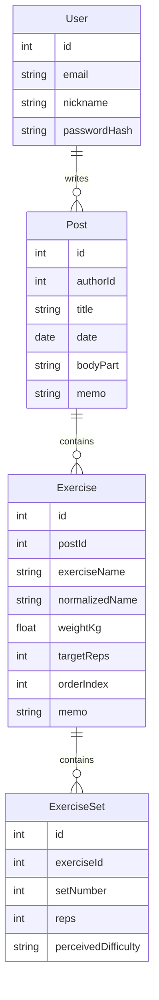

# 06. DB 설계 문서

이 문서는 PostgreSQL과 Prisma 모델이 어떤 데이터를 저장하는지 설명한다.

초보자에게 DB 설계는 “무엇을 어떤 상자에 저장할 것인가”를 정하는 일이다.

이 프로젝트의 핵심 구조는 다음이다.

```text
User
  -> Post[]
      -> Exercise[]
          -> ExerciseSet[]
```

---

## 1. 현재 ERD



---

## 2. User 모델

### 무엇을 저장하는가?

User는 서비스 사용자를 저장한다.

주요 필드:

```text
id
email
nickname
passwordHash
posts
```

### 주요 필드 설명

| 필드 | 의미 |
|---|---|
| id | 사용자를 구분하는 고유 ID |
| email | 로그인에 사용하는 이메일 |
| nickname | 화면에 보여줄 이름 |
| passwordHash | 해싱된 비밀번호 |
| posts | 사용자가 작성한 게시글 목록 |

### 다른 테이블과 관계

```text
User 1명은 Post 여러 개를 작성할 수 있다.
```

### 왜 필요한가?

운동 기록은 사용자별로 분리되어야 한다.

AI 분석도 “로그인한 사용자의 이전 기록”을 기준으로 해야 한다.

### 확장 가능성

나중에 다음 필드를 추가할 수 있다.

```text
profileImage
height
weight
trainingGoal
createdAt
updatedAt
```

하지만 현재 MVP에서는 필요하지 않다.

---

## 3. Post 모델

### 무엇을 저장하는가?

Post는 운동 기록 게시글을 저장한다.

사용자가 하루 운동 기록을 남기는 상위 단위다.

주요 필드:

```text
id
authorId
title
date
bodyPart
memo
author
exercises
```

### 주요 필드 설명

| 필드 | 의미 |
|---|---|
| id | 게시글 ID |
| authorId | 작성자 User ID |
| title | 게시글 제목 |
| date | 운동 날짜 |
| bodyPart | 운동 부위 |
| memo | 전체 운동 메모 |
| author | 작성자 정보 |
| exercises | 게시글 안의 운동 목록 |

### 다른 테이블과 관계

```text
User -> Post[]
Post -> Exercise[]
```

### 왜 운동 기록에 적합한가?

운동 기록은 보통 하루 또는 한 세션 단위로 작성한다.

예:

```text
제목: 6월 13일 가슴 운동
부위: 가슴
메모: 벤치프레스가 지난번보다 좋아짐
운동 목록: 벤치프레스, 인클라인 덤벨프레스
```

이런 상위 정보를 Post가 담당한다.

### RAG/pgvector 확장 가능성

RAG에서 Post는 “현재 기록”과 “이전 기록”의 기준이 된다.

나중에 AI 분석 결과를 저장하고 싶다면 별도 `AnalysisResult` 모델을 만들 수 있다.

---

## 4. Exercise 모델

### 무엇을 저장하는가?

Exercise는 게시글 안의 개별 운동을 저장한다.

주요 필드:

```text
id
postId
exerciseName
normalizedName
weightKg
targetReps
orderIndex
memo
sets
```

### 주요 필드 설명

| 필드 | 의미 |
|---|---|
| id | 운동 ID |
| postId | 이 운동이 속한 게시글 ID |
| exerciseName | 사용자가 입력한 운동명 |
| normalizedName | 정규화된 운동명 |
| weightKg | 사용 중량 |
| targetReps | 목표 반복 수 |
| orderIndex | 게시글 안에서 운동 순서 |
| memo | 운동별 메모 |
| sets | 세트 기록 목록 |

### 다른 테이블과 관계

```text
Post -> Exercise[]
Exercise -> ExerciseSet[]
```

### 왜 운동 기록에 적합한가?

게시글 하나에는 여러 운동이 들어갈 수 있다.

예:

```text
Post: 6월 13일 가슴 운동
  Exercise: 벤치프레스
  Exercise: 인클라인 덤벨프레스
  Exercise: 케이블 플라이
```

각 운동은 무게, 목표 반복 수, 메모가 다를 수 있다.

### RAG/pgvector 확장 가능성

RAG의 핵심 검색 기준은 운동명이다.

현재 최소 RAG 기준:

```text
같은 사용자
+ 같은 운동명
+ 최근 기록 N개
```

이때 `normalizedName`이 중요해진다.

예:

```text
벤치
bench press
벤치프레스
```

이 세 입력을 모두 `벤치프레스`로 정규화하면 이전 기록 검색 품질이 좋아진다.

---

## 5. ExerciseSet 모델

### 무엇을 저장하는가?

ExerciseSet은 운동 하나의 세트 기록을 저장한다.

주요 필드:

```text
id
exerciseId
setNumber
reps
perceivedDifficulty
```

### 주요 필드 설명

| 필드 | 의미 |
|---|---|
| id | 세트 ID |
| exerciseId | 이 세트가 속한 운동 ID |
| setNumber | 몇 번째 세트인지 |
| reps | 실제 반복 수 |
| perceivedDifficulty | 체감 난이도 |

### 다른 테이블과 관계

```text
Exercise -> ExerciseSet[]
```

### 왜 운동 기록에 적합한가?

점진적 과부하를 판단하려면 세트별 반복 수가 중요하다.

예:

```text
현재 기록: 60kg 8/8/7
이전 기록: 60kg 8/7/6
```

이 정보는 ExerciseSet에 저장된다.

### RAG/pgvector 확장 가능성

AI 분석은 세트 기록을 읽어 다음을 판단할 수 있다.

- 반복 수가 늘었는가?
- 목표 반복 수를 채웠는가?
- 같은 무게를 유지할지 올릴지 판단할 수 있는가?

---

## 6. 현재 구조가 운동 기록에 적합한 이유

현재 구조의 장점은 다음이다.

```text
게시글 단위 기록
-> 운동별 기록
-> 세트별 기록
```

이 구조는 실제 운동 기록 방식과 비슷하다.

예:

```text
6월 13일 가슴 운동
  벤치프레스 60kg
    1세트 8회
    2세트 8회
    3세트 7회
  인클라인 덤벨프레스 20kg
    1세트 10회
    2세트 9회
```

AI는 이 구조를 이용해 현재 기록과 이전 기록을 비교할 수 있다.

---

## 7. DB 변경 전 체크리스트

Prisma schema를 바꾸기 전에 Codex는 반드시 다음을 확인한다.

```text
이 필드가 정말 필요한가?
기존 데이터와 충돌하지 않는가?
migration이 필요한가?
백엔드 DTO도 바뀌는가?
프론트 타입도 바뀌는가?
API 응답 형식도 바뀌는가?
README ERD도 업데이트해야 하는가?
```

DB 변경은 프로젝트를 크게 바꿀 수 있으므로, 사용자 승인 없이 하면 안 된다.

---

## 8. pgvector 확장 아이디어

현재 pgvector는 필수 구현이 아니다.

나중에 붙인다면 다음 목적이 될 수 있다.

```text
운동 기록 메모나 분석 내용을 embedding으로 저장하고,
의미가 비슷한 과거 기록을 검색한다.
```

예상 확장 모델:

```text
WorkoutEmbedding
  id
  postId
  content
  embedding
```

하지만 현재 발표에서는 다음 정도로 충분하다.

```text
현재는 pgvector 없이 구조화된 DB 검색으로 같은 사용자와 같은 운동명의 최근 기록을 찾아 AI 분석 재료로 사용한다.
향후 pgvector를 붙이면 운동명뿐 아니라 메모나 문맥까지 유사한 기록을 검색할 수 있다.
```

---

## 9. AI 분석 결과 저장 여부

현재 AI 분석 결과는 화면에 표시만 한다.

나중에 저장하고 싶다면 다음 모델을 고려할 수 있다.

```text
AnalysisResult
  id
  postId
  summary
  recommendation
  nextGoal
  referencedPostCount
  createdAt
```

하지만 지금은 필수 구현이 아니다.

이유:

- 현재는 demo analysis 단계다.
- 분석 결과 저장까지 하면 DB와 UI 범위가 커진다.
- 발표에서는 실시간 분석 흐름을 보여주는 것으로 충분하다.

---

## 10. 현재 DB 설계 한 줄 정리

```text
User가 Post를 작성하고, Post 안에 Exercise가 있고, Exercise 안에 ExerciseSet이 있다.
이 구조 덕분에 AI가 현재 기록과 이전 기록을 운동명과 세트 단위로 비교할 수 있다.
```
