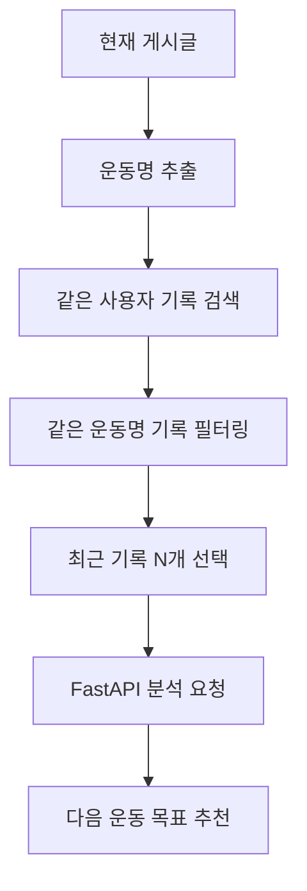
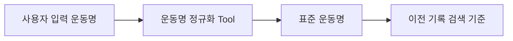
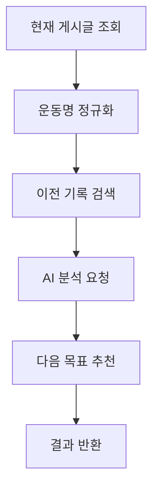

# 07. AI / RAG / MCP / Agent 설계 문서

이 문서는 현재 AI 분석 기능을 어떻게 확장할지 정리한다.

중요한 원칙은 다음이다.

```text
과장하지 않는다.
현재 구현 수준에서 발표 가능한 최소 기준으로 설명한다.
```

---

## 1. 현재 AI 분석 상태

현재 AI 분석은 GPT를 직접 호출하지 않는다.

현재 구조:

```text
React 상세 화면
-> NestJS POST /posts/:id/analyze
-> NestJS가 현재 게시글과 이전 기록 조회
-> NestJS가 FastAPI /analysis/demo 호출
-> FastAPI가 demo 분석 결과 반환
-> React 화면 표시
```

현재 장점:

- React -> NestJS -> FastAPI -> NestJS -> React 연결 성공
- JWT 인증 적용
- 작성자 검사 적용
- 현재 게시글과 이전 기록을 AI 서버로 보내는 구조 존재

현재 한계:

- 실제 OpenAI API를 호출하지 않음
- 분석 문장이 demo 수준
- 운동명 정규화가 약하면 이전 기록 검색 품질이 떨어질 수 있음
- pgvector 기반 semantic search는 아직 없음

---

## 2. 현재 demo analysis의 한계

현재 FastAPI는 임시 분석 결과를 만든다.

따라서 다음처럼 표현하면 안 된다.

```text
실제 GPT가 운동 기록을 분석한다.
완성형 AI 운동 코치다.
완성형 RAG 시스템이다.
```

대신 다음처럼 표현한다.

```text
현재는 AI 분석 서버와의 연결 구조를 완성했고, FastAPI에서 demo 분석 결과를 반환한다.
다음 단계에서 OpenAI API를 연결하면 실제 LLM 기반 분석으로 확장할 수 있다.
```

---

## 3. 이 프로젝트의 RAG 최소 기준

일반적으로 RAG는 외부 지식이나 저장된 데이터를 검색해서 LLM 응답에 참고 자료로 넣는 흐름이다.

이 프로젝트에서는 운동 기록 DB가 검색 대상이다.

최소 기준:

```text
로그인한 사용자
+ 같은 운동명
+ 최근 기록 N개
-> AI 분석 재료로 사용
```

이 방식은 pgvector 없이도 “구조화 검색 기반 RAG”로 설명할 수 있다.

단, 표현은 조심해야 한다.

좋은 표현:

```text
현재는 pgvector 없이, PostgreSQL에 저장된 운동 기록을 구조화 조건으로 검색해 AI 분석 재료로 사용하는 최소 RAG 흐름을 구현/설계했다.
```

나쁜 표현:

```text
벡터 검색 기반 고도화 RAG를 완성했다.
```

---

## 4. 구조화 검색 기반 RAG 흐름



실제 코드 흐름:

```text
PostsService.analyze()
-> 현재 게시글 조회
-> 현재 게시글의 운동명 목록 추출
-> 같은 사용자의 이전 게시글 검색
-> 같은 운동명을 가진 기록만 선택
-> 최대 3개 정도 FastAPI로 전달
-> FastAPI가 분석 결과 반환
```

---

## 5. RAG에서 사용하는 데이터

RAG 재료로 사용할 수 있는 데이터:

```text
현재 게시글
- title
- date
- bodyPart
- memo
- exercises
- sets

이전 게시글
- date
- exercises
- sets
```

AI에게 중요한 비교 정보:

```text
운동명
중량
목표 반복 수
실제 반복 수
세트별 기록
이전 기록 개수
```

예:

```text
현재 기록: 벤치프레스 60kg 8/8/7
이전 기록: 벤치프레스 60kg 8/7/6
```

분석 방향:

```text
반복 수가 늘었으므로 발전이 있다.
다음 운동에서는 같은 무게로 8/8/8을 목표로 하거나,
컨디션이 좋으면 소폭 증량을 고려할 수 있다.
```

의학적 판단은 하지 않는다.

---

## 6. OpenAI API 연결 위치

OpenAI API 연결은 FastAPI 쪽에서 진행한다.

예상 위치:

```text
ai-server/app/services/analysis_service.py
```

이유:

- FastAPI가 AI 분석 책임을 담당한다.
- NestJS는 인증, DB 조회, FastAPI 호출에 집중한다.
- React는 화면 표시만 담당한다.

좋은 흐름:

```text
NestJS
-> 현재 기록과 이전 기록을 FastAPI로 전달
-> FastAPI analysis_service.py에서 OpenAI API 호출
-> 분석 결과 반환
```

나쁜 흐름:

```text
React에서 OpenAI API 직접 호출
NestJS에서 OpenAI와 FastAPI 역할을 모두 담당
FastAPI가 PostgreSQL 직접 조회
```

---

## 7. OpenAI 연결 시 설계 기준

OpenAI를 연결할 때 Codex는 다음을 먼저 확인해야 한다.

```text
API Key는 어디서 읽는가?
.env에 어떤 값이 필요한가?
analysis_service.py의 어떤 함수를 바꾸는가?
기존 /analysis/demo 응답 형식을 유지하는가?
실패 시 demo fallback이 필요한가?
토큰 비용을 줄이기 위해 이전 기록을 몇 개만 보낼 것인가?
의학 조언을 하지 않도록 시스템 지시문을 넣는가?
```

응답 형식은 가능하면 현재와 유지한다.

```json
{
  "summary": "string",
  "recommendation": "string",
  "nextGoal": "string",
  "referencedPostCount": 0
}
```

이렇게 해야 React 화면 수정 범위가 작아진다.

---

## 8. MCP 최소 구현 후보

현실적인 MCP/tool 후보는 운동명 정규화 tool이다.

문제:

```text
벤치
벤치프레스
bench press
Bench Press
```

사용자는 같은 운동을 여러 방식으로 입력할 수 있다.

정규화 결과:

```text
벤치프레스
```

이 정규화 결과를 RAG 검색 기준으로 사용한다.

---

## 9. 운동명 정규화 tool 설계

처음에는 큰 MCP 서버를 만들지 말고 작은 함수나 서비스로 시작한다.

입력:

```text
사용자가 입력한 운동명
```

출력:

```text
표준 운동명
```

예:

```text
bench press -> 벤치프레스
벤치 -> 벤치프레스
벤치프레스 -> 벤치프레스
squat -> 스쿼트
스쿼트 -> 스쿼트
```

Mermaid 흐름:



발표 표현:

```text
운동명 정규화는 MCP/tool로 분리하기 좋은 후보입니다.
현재는 간단한 정규화 함수로 시작하고, 이후 외부 tool 호출 구조로 확장할 수 있습니다.
```

---

## 10. Agent workflow 최소 흐름

완전 자율 에이전트가 아니라 정해진 단계를 수행하는 workflow로 표현한다.



단계 설명:

| 단계 | 설명 | 담당 |
|---|---|---|
| 1 | 현재 게시글 조회 | NestJS |
| 2 | 운동명 정규화 | Tool 또는 함수 |
| 3 | 이전 기록 검색 | NestJS + PostgreSQL |
| 4 | AI 분석 요청 | NestJS -> FastAPI |
| 5 | 다음 목표 추천 | FastAPI + OpenAI |
| 6 | 결과 반환 | FastAPI -> NestJS -> React |

발표 표현:

```text
이 프로젝트의 Agent workflow는 완전 자율 에이전트가 아니라, 운동 기록 분석에 필요한 단계를 순서대로 수행하는 workflow입니다.
```

---

## 11. AI 분석 프롬프트 방향

OpenAI를 연결할 때 프롬프트는 다음 경계를 지켜야 한다.

해야 하는 것:

```text
- 현재 기록 요약
- 이전 기록과 비교
- 반복 수 변화 설명
- 다음 운동 목표 제안
- 초보자가 이해하기 쉬운 말로 설명
```

하면 안 되는 것:

```text
- 부상 진단
- 통증 원인 판단
- 의학적 처방
- 무리한 증량 지시
- 확실하지 않은 결론 단정
```

응답 예시:

```text
이번 벤치프레스는 60kg에서 8/8/7회를 기록했습니다.
이전 기록이 8/7/6회였다면 반복 수가 전반적으로 증가했습니다.
다음 운동에서는 같은 무게로 8/8/8을 안정적으로 채우는 것을 목표로 잡는 것이 좋습니다.
```

---

## 12. 다음 작업 우선순위

추천 순서:

```text
1. 현재 analyze 흐름을 구조화 검색 기반 RAG라고 설명 가능하게 정리
2. README에 RAG 흐름 다이어그램 추가
3. OpenAI API 연결
4. 운동명 정규화 함수 추가
5. MCP/tool 후보로 문서화
6. Agent workflow를 README와 발표자료에 정리
```

---

## 13. Codex에게 RAG 작업을 맡길 때 프롬프트

```text
AGENTS.md와 docs/07-ai-rag-design.md를 읽어줘.
아직 코드를 수정하지 말고, 현재 POST /posts/:id/analyze 흐름을 기준으로 구조화 검색 기반 RAG 최소 구현을 어떻게 정리할지 먼저 설명해줘.

조건:
- pgvector는 지금 붙이지 않는다.
- 로그인한 사용자 + 같은 운동명 + 최근 기록 N개를 AI 분석 재료로 사용한다.
- React가 FastAPI를 직접 호출하지 않는 원칙은 유지한다.
- 기존 API 응답 형식은 가능하면 유지한다.
- 구현 전에 수정할 파일 목록과 테스트 방법을 먼저 말해줘.
```

---

## 14. 현재 AI 설계 한 줄 정리

```text
현재 AI 분석은 demo 수준이지만, NestJS가 현재 기록과 이전 기록을 모아 FastAPI에 전달하는 구조는 완성되어 있다.
다음 단계는 이 흐름을 구조화 검색 기반 RAG로 정리하고, FastAPI의 analysis_service.py에 OpenAI API를 연결하는 것이다.
```
